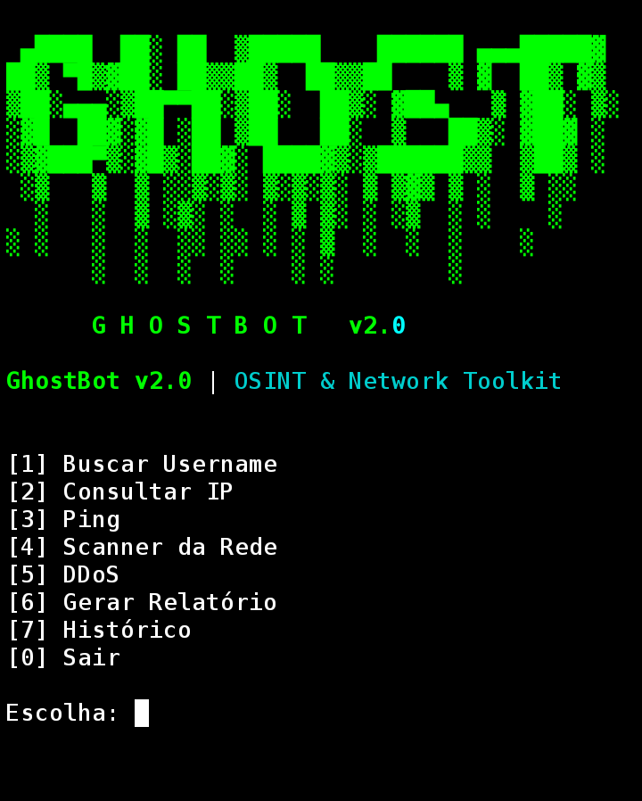

# Ghost
## 📸 Preview



## 🧠 Sobre o projeto
Ghost é um script em Python feito pra automação e testes locais.
Python CLI automation tool for local scripting, testing workflows, and lightweight task automation with async support and SQLite history tracking.
---

## ⚙️ Requisitos
- Python 3.x instalado
- pip (gerenciador de pacotes)

---
## 📦 Instalação

Clone o repositório:
```bash
git clone https://github.com/diegoerick778-crypto/Ghost.git
cd Ghost


#como executar
chmod +x ghostbot.py
./ghostbot.py
